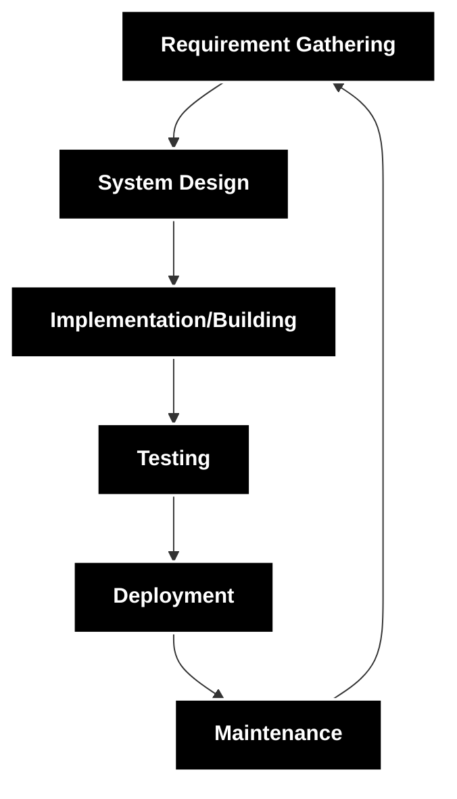

# Software Development Life Cycle (SDLC)

```mermaid
flowchart TD
    A[Requirement Gathering] --> B[System Design]
    B --> C[Implementation/Building]
    C --> D[Testing]
    D --> E[Deployment]
    E --> F[Maintenance]
    F --> A

    style A fill:#000,stroke:#fff,stroke-width:2px,color:#fff,font-weight:bold
    style B fill:#000,stroke:#fff,stroke-width:2px,color:#fff,font-weight:bold
    style C fill:#000,stroke:#fff,stroke-width:2px,color:#fff,font-weight:bold
    style D fill:#000,stroke:#fff,stroke-width:2px,color:#fff,font-weight:bold
    style E fill:#000,stroke:#fff,stroke-width:2px,color:#fff,font-weight:bold
    style F fill:#000,stroke:#fff,stroke-width:2px,color:#fff,font-weight:bold

```
- DevOps is culture bridge between Development and Operation make the above cycle smooth reduce the time.
- ML Pipelines contain following stages
    1. Data Collection/ Data Injestion
    2. Data Preparation
    3. Feature Extraction
    4. Model Building
    5. Model Evaluation
- https://dvc.org/doc, Data Version Control (dvc) is open sourec tool that handles large data sets and machine learning models. IT is similar to GTI to mange and verison control the data.
- Key features
    - version control
    - data management
    - reproducibility
    - collaboration
    - pipeline managment
- We are going to Data version control in yml file which contains the following modules
1. cmd - to execute the stage
2. Inputs - dependency required for the current stage. 
3. output - Result produce by the stage.
