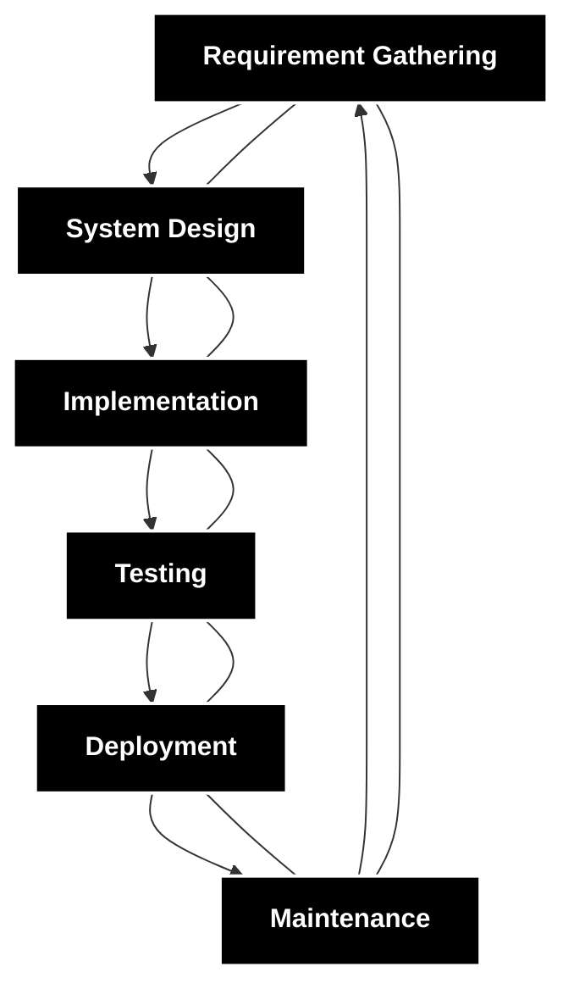

# Software Development Life Cycle (SDLC)

- ML Pipelines contain following stages
    1. Data Collection/ Data Injestion
    2. Data Preparation
    3. Feature Extraction
    4. Model Building
    5. Model Evaluation
- We are going to Data version control in yml file which contains the following modules
1. cmd - to execute the stage
2. Inputs - dependency required for the current stage. 
3. output - Result produce by the stage.
